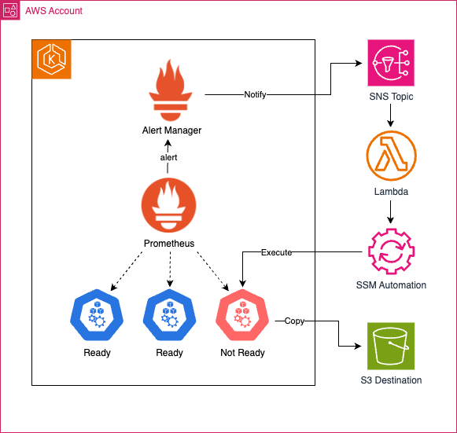

# EKS Node Log Collector Automation using SSM and Alert Manager

EKS Node Log Collector Automation receives alerts from EKS cluster(s) and executes the AWSSupport-CollectEKSInstanceLogs SAW Workflow.

## Architecture


## Setup Instructions

#### 1. Create an EKS Cluster
```
export CLUSTER_NAME=<cluster-name>
export CLUSTER_REGION=<region>
export AWS_ACCOUNT_ID=<aws-account-id>
eksctl create cluster --name ${CLUSTER_NAME} --region ${CLUSTER_REGION}
```

#### 2. Deploy AWS SAM template to create the S3 Bucket, Lambda function, SNS Topic, and related components
```
sam build --use-container
sam deploy --stack-name elca-${CLUSTER_NAME}-${CLUSTER_REGION} \
           --s3-prefix elca-${CLUSTER_NAME}-${CLUSTER_REGION} \
           --region ${CLUSTER_REGION} \
           --parameter-overrides ParameterKey=ClusterID,ParameterValue=${CLUSTER_NAME} \
                                 ParameterKey=ClusterRegion,ParameterValue=${CLUSTER_REGION} \
                                 ParameterKey=LogRetentionDays,ParameterValue=7
```
```
# Set the SNS Topic created in the above step as an environment variable
export SNS_TOPIC_ARN=<topic-arn-from-sam-deploy-output>
export LOG_COLLECTION_BUCKET=<LogCollectionS3Bucket-arn-from-sam-deploy-output>
export LAMBDA_EXECUTION_ROLE_ARN=<iam-role-arn-of-SSMTriggerFunctionIAMRole-from-sam-deploy-output>
```

#### 3. Create an IAM Policy and attach it to EKS nodegroup IAM Role(s) for log bundle upload permissions
```
cat <<EOF > /tmp/s3-log-upload-policy.json
{
    "Version": "2012-10-17",
    "Statement": [
        {
            "Effect": "Allow",
            "Action": [
                "s3:GetBucketAcl",
                "s3:GetBucketPolicyStatus"
            ],
            "Resource": "$LOG_COLLECTION_BUCKET"
        },
        {
            "Effect": "Allow",
            "Action": [
                "s3:PutObject"
            ],
            "Resource": "$LOG_COLLECTION_BUCKET/eks_i-*"
        }
    ]
}
EOF

aws iam create-policy --policy-name SSMAutomationEKSLogCollector-${CLUSTER_NAME}-${CLUSTER_REGION} --policy-document file:///tmp/s3-log-upload-policy.json

NODEGROUP_ROLE_NAME=$(eksctl get nodegroups --cluster $CLUSTER_NAME --region $CLUSTER_REGION -o json | jq -r '.[0].NodeInstanceRoleARN' | cut -d'/' -f2)

aws iam attach-role-policy --role-name $NODEGROUP_ROLE_NAME --policy-arn arn:aws:iam::$AWS_ACCOUNT_ID:policy/SSMAutomationEKSLogCollector-${CLUSTER_NAME}-${CLUSTER_REGION}
```

#### 4. Create an IRSA role for the alertmanager pod to perform AWS actions
```
cat <<EOF > /tmp/alertmanager-sns-policy.json
{
    "Version": "2012-10-17",
    "Statement": [
        {
            "Sid": "VisualEditor0",
            "Effect": "Allow",
            "Action": [
                "sns:Publish"
            ],
            "Resource":"*"
        }
    ]
}
EOF

aws iam create-policy --policy-name AlertManagerSNSPolicy-${CLUSTER_NAME}-${CLUSTER_REGION}  --policy-document file:///tmp/alertmanager-sns-policy.json --region ${CLUSTER_REGION}
```

```
eksctl utils associate-iam-oidc-provider --region=${CLUSTER_REGION} --cluster=${CLUSTER_NAME} --approve
```

```
eksctl create iamserviceaccount \
    --cluster=${CLUSTER_NAME} \
    --namespace=prometheus \
    --name=alertmanager \
    --role-name AlertManagerSNSRole-${CLUSTER_NAME}-${CLUSTER_REGION} \
    --attach-policy-arn=arn:aws:iam::${AWS_ACCOUNT_ID}:policy/AlertManagerSNSPolicy-${CLUSTER_NAME}-${CLUSTER_REGION} \
    --region=${CLUSTER_REGION} \
    --approve
```

#### 5. Deploy the kube-prometheus-stack helm chart
```
helm repo add prometheus-community https://prometheus-community.github.io/helm-charts
helm repo update
sed "s/TOPIC_ARN/$SNS_TOPIC_ARN/g; s/REGION/$CLUSTER_REGION/g" prometheus/kube-prometheus-stack-values.yaml.tmp > prometheus/kube-prometheus-stack-values.yaml
helm upgrade --install prometheus prometheus-community/kube-prometheus-stack -n prometheus --values ./prometheus/kube-prometheus-stack-values.yaml
```

#### 6. Provide EKS read-only access to the Lambda IAM Role

```
kubectl create clusterrole elca-nodeviewer --verb=get,list,watch --resource=nodes
kubectl create clusterrolebinding elca-nodeviewer --clusterrole=elca-nodeviewer --group=elca-nodeviewer

aws eks create-access-entry --cluster-name ${CLUSTER_NAME} \
    --principal-arn ${LAMBDA_EXECUTION_ROLE_ARN} \
    --kubernetes-groups elca-nodeviewer \
    --region ${CLUSTER_REGION}
```

#### 7. Test the workflow

Using SSM, log into few EKS nodes using the below command:
```
aws ssm start-session --target <instance-id>
```
Run the below command using sudo:
```
sudo systemctl stop kubelet
exit
```
This will stop kubelet on the nodes, and corresponding alerts are sent from the EKS cluster to the Lambda, which in turn executes the AWSSupport-CollectEKSInstanceLogs Support Automation Workflow (SAW).